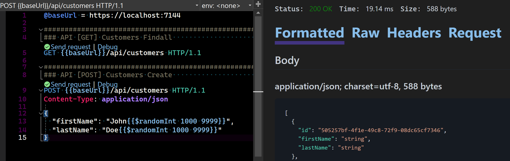

=====================================


# Architecture overview

> An application built using .NET 8 and following a Domain-Driven Design approach by using the
> BridgingIT DevKit.

## Features

- Application Commands/Queries: encapsulate business logic and data access
- Application Models and Contracts: specifies the public API can be exposed to clients
- Application Module Clients: expose a public API for other modules to use
- Application Query Services: provide complex queries not suitable for repositories
- Domain Model, ValueObjects, Events, Rules, TypedIds, Repositories: the building blocks to
  implement the domain model
- Modules: encapsulates related functionality into separate modules
- Messaging: provides asynchronous communication between modules based on messages
- Presentation Endpoints: expose an external HTTP API for the application
- Unit & Integration Tests: ensure the reliability of the application

## Key Technologies and Frameworks

- [.NET 8](https://learn.microsoft.com/en-us/dotnet/core/whats-new/dotnet-8/overview)
- [C#](https://learn.microsoft.com/en-us/dotnet/csharp/)
- [Entity Framework Core](https://learn.microsoft.com/en-us/ef/core/)
- [ASP.NET Core](https://dotnet.microsoft.com/en-us/apps/aspnet)
- [Serilog](https://serilog.net/)
- MediatR
- FluentValidation
- Mapster
- OpenTelemetry
- [xUnit.net](https://xunit.net/), [NSubstitute](https://nsubstitute.github.io/), [Shouldly](https://docs.shouldly.org/)

## Architecture Overview

The application is designed as a modular monolith, adhering to Clean Architecture
principles and Domain-Driven Design (DDD) concepts. Built using .NET Core, it's organized into
several distinct modules, each focusing on a specific business domain.

### Patterns & Principles

This architecture provides a scalable, maintainable, and modular structure for the application,
allowing for easy extension and modification of individual modules while maintaining a
cohesive overall system.
The modular approach combined with Clean Architecture and DDD principles ensures clear separation of
concerns and high cohesion within each module.

1. **Domain-Driven Design (DDD)**: Evident in the use of aggregates, entities, value objects, and
   domain events.
2. **Modularization**: The application is divided into distinct, loosely-coupled modules, each with
   its own domain logic and infrastructure.
3. **Screaming Architecture**: The folder structure and namespaces reflect the business domains
   rather than technical concerns.
4. **The Dependency Rule**: Dependencies can only point inwards. Nothing in an inner circle can know
   anything at all about something in an outer circle (See Layers).
5. **Dependency Injection (DI)**: Widely used throughout the application for loose coupling and
   better testability.
6. **CQS (Command Query Separation)**: Commands and queries are separated, but using the same
   persistence store.
7. **Use Cases**: Application logic is encapsulated in commands and queries, each with a single
   responsibility.
8. **Mediator Pattern**: MediatR is used for handling commands and queries.
9. **Repository Pattern**: Used for data access and persistence.
10. **Specification Pattern**: Used for defining query criteria.
11. **Outbox Pattern**: Used for reliable event and message publishing.

### Layers

The solution is structured following the Clean Architecture layers and the references
between them:

- **Domain**: Contains the core business logic and domain model.
- **Application**: Handles application-specific logic, including commands and queries.
- **Infrastructure**: Manages data access, external services, and other infrastructure concerns.
- **Presentation**: Provides the user interface and API endpoints.
- **SharedKernel**: Contains shared concepts, such as value objects, rules, and interfaces.


Key Points:

- Domain layer remains independent, not referencing other layers
- Infrastructure layer doesn't directly reference the Application or Domain layer
- Adheres to the DI principle: high-level layers (Domain, Application) don't depend on low-level
  layer (Infrastructure), but both depend on abstractions

#### 1. Domain Layer

The Domain layer is the core of the application, containing the business logic and rules.

Key components:

- Entities (e.g., `Book`, `Author`, `Stock`)
- Value Objects (e.g., `Money`, `BookIsbn`, `EmailAddress`)
- Aggregates (e.g., `Book` aggregate, `Stock` aggregate)
- Domain Events (e.g., `BookCreatedDomainEvent`, `StockUpdatedDomainEvent`)
- Specifications (e.g., `BookForIsbnSpecification`)
- Policies
- Rules

Characteristics:

- No dependencies on other layers or external libraries (except for some .NET base classes)
- Contains the core business logic and rules
- Defines interfaces for repositories (e.g., `IBookRepository`)

Example from the application:

```csharp
public class Book : AuditableAggregateRoot<BookId>, IConcurrent
{
    public TenantId TenantId { get; }
    public string Title { get; private set; }
    public BookIsbn Isbn { get; private set; }
    public Money Price { get; private set; }
    // ... other properties and methods
}
```

#### 2. Application Layer

The Application layer orchestrates the flow of data to and from the Domain layer, and coordinates
application logic.

Key components:

- Command/Query Handlers (e.g., `BookCreateCommandHandler`, `BookFindOneQueryHandler`)
- Commands and Queries (e.g., `BookCreateCommand`, `BookFindOneQuery`)
- Interfaces for infrastructure concerns (e.g., `IBookRepository`)
- Application Services (e.g., `ICatalogQueryService`)
- Application Models (Contracts)

Characteristics:

- Depends on the Domain layer
- Contains no business logic
- Orchestrates the execution of business logic defined in the Domain layer
- Uses the Mediator pattern (via MediatR) for handling commands and queries

Example from the application:

```csharp

public class BookCreateCommand(string tenantId, BookModel model)
  : CommandRequestBase<Result<Book>>, ITenantAware
{
    public string TenantId { get; } = tenantId;

    public BookModel Model { get; } = model;

    public override ValidationResult Validate()
    {
        return new Validator().Validate(this);
    }

    public class Validator : AbstractValidator<BookCreateCommand>
    {
        public Validator()
        {
          // Add validation rules (RuleFor)
        }
    }
}

public class BookCreateCommandHandler
  : CommandHandlerBase<BookCreateCommand, Result<Book>>
{
    private readonly IGenericRepository<Book> repository;

    public BookCreateCommandHandler(ILoggerFactory loggerFactory, IGenericRepository<Book> repository)
        : base(loggerFactory)
    {
        this.repository = repository;
    }

    public override async Task<CommandResponse<Result<Book>>> Process(BookCreateCommand command, CancellationToken cancellationToken)
    {
        // Create book entity, apply business rules, save to repository
    }
}
```

#### 3. Infrastructure Layer

The Infrastructure layer provides implementations for database access, external services, and other
infrastructure concerns.

Key components:

- Repository/QueryService Implementations
- Database Contexts (e.g., `CatalogDbContext`, `InventoryDbContext`)
- Entity Configurations (e.g., `BookEntityTypeConfiguration`)
- External Service Clients
- Infrastructure-specific Models

Characteristics:

- Depends on the Application and Domain layers
- Implements interfaces defined in the Application layer
- Contains database-specific logic and ORM configurations
- Handles data persistence and retrieval

Example from the application:

```csharp
public class CatalogDbContext : ModuleDbContextBase, IDocumentStoreContext, IOutboxDomainEventContext
{
    public DbSet<Book> Books { get; set; }
    public DbSet<Author> Authors { get; set; }
    // ... other DbSets and configuration
}
```

#### 4. Presentation Layer

The Presentation layer is responsible for handling HTTP requests and presenting data to the client.

Key components:

- API Controllers or Minimal API Endpoints
- Middleware

Characteristics:

- Depends on the Application layer
- Handles HTTP requests and responses
- Maps between Application models and Application layer commands/queries
- Implements API-specific concerns (authentication, authorization, etc.)

Example from the application:

```csharp
public class CatalogBookEndpoints : EndpointsBase
{
    public override void Map(IEndpointRouteBuilder app)
    {
        app.MapGet("/api/books/{id}", GetBook);
        app.MapPost("/api/books", CreateBook);
        // ... other endpoint mappings
    }

    private static async Task<IResult> GetBook(IMediator mediator, string id)
    {
        var result = await mediator.Send(new BookFindOneQuery(id));
        return result.Match(
            success => Results.Ok(success),
            failure => Results.NotFound());
    }
}
```

### Request Processing Flow

The following sequence diagram illustrates the flow of a request through the layers of the
application:


1. The process begins when a Client sends a Web Request to the External API.
2. The External API creates a Command object, which includes a Model.
3. The Command is then validated by a CommandValidator, which returns a Validation Result.
4. If validation passes, the Command is processed by a CommandHandler.
5. The CommandHandler interacts with a Repository to find an existing entity using FindOneResultAsync(EntityId).
6. Once the existing entity is retrieved, a Mapper is used to update the Domain Entity with the new data from the Model.
7. The CommandHandler then applies any necessary Domain Rules to the updated entity.
8. The updated Domain Entity is then saved back to the Repository using UpdateAsync(Domain Entity).
9. The Repository returns the updated Domain Entity to the CommandHandler.
10. The CommandHandler returns a Result to the External API.
11. The External API uses the Mapper again to convert the Domain Entity back into a Model.
12. Finally, the External API formats the response and sends the Web Response back to the Client.

### Architecture Decision Records (ADR)

An [Architecture Decision Record](https://github.com/joelparkerhenderson/architecture-decision-record?tab=readme-ov-file)
(ADR) is a document that captures an important architectural decision made along with its context
and consequences.

These ADRs outline key architectural decisions for the application, focusing on a modular monolith
structure with clear boundaries between modules, rich domain models, and a mix of synchronous and
asynchronous communication between modules:

- [adr-001-modular-monolith.md](docs%2Fadrs%2Fadr-001-modular-monolith.md)
- [adr-002-http-api.md](docs%2Fadrs%2Fadr-002-http-api.md)
- [adr-003-sync-module-clients.md](docs%2Fadrs%2Fadr-003-sync-module-clients.md)
- [adr-004-async-messaging.md](docs%2Fadrs%2Fadr-004-async-messaging.md)
- [adr-005-rich-domain-models.md](docs%2Fadrs%2Fadr-005-rich-domain-models.md)
- [adr-006-database-choice.md](docs%2Fadrs%2Fadr-006-database-choice.md)
- [adr-007-logging-monitoring.md](docs%2Fadrs%2Fadr-007-logging-monitoring.md)
- [adr-008-modularization-strategy.md](docs%2Fadrs%2Fadr-008-modularization-strategy.md)

### Cross-cutting Concerns

While not a specific layer, cross-cutting concerns are handled across all layers:

- Logging (using Serilog)
- Validation (using FluentValidation)
- Authentication and Authorization
- Error Handling
- Caching
- Multitenancy

These concerns are often implemented using middleware, attributes, or by integrating into the
request pipeline.

This layered architecture ensures a clear separation of concerns, with each layer having a distinct
responsibility. The dependencies flow inwards, with the Domain layer at the core having no external
dependencies. This structure allows for easier testing, maintenance, and evolution of the system
over time.

## Data Storage

- SQL Server is used as the primary database.
- Each module has its own DbContext for database operations.
- Each module has its own schema and migrations in the database.

## External API Layer

- RESTful APIs are implemented using minimal API syntax in .NET Core.
- OpenAPI (Swagger) is used for API documentation.

## Application Testing

- The architecture supports unit testing, integration testing, and end-to-end testing.
- Integration testing depends on docker containers.

## Modular Structure

The application is divided into the following main modules:


### Organization Module

> Manages tenants, companies, and subscriptions.

[see](./src/Modules/Organization/Organization-README.md)

### Catalog Module

> Manages books, authors, and categories.

[see](./src/Modules/Catalog/Catalog-README.md)

### Inventory Module

> Handles stock management and inventory tracking.

[see](./src/Modules/Inventory/Inventory-README.md)

## Getting Started

TODO

### Prerequisites

- Docker Desktop
- Visual Studio (Code)

### Running the Application

The supporting containers should first be started with `docker-compose up` or
`docker-compose up -d`.
Then the Presentation.Web.Server project can be set as the startup project.
On `CTRL+F5` this will start the host at [https://localhost:7144](https://localhost:7144).

- [SQL Server](https://learn.microsoft.com/en-us/sql/sql-server/?view=sql-server-ver16) details:
  `Server=127.0.0.1,14339;Database=bit_devkit_bookfiesta;User=sa;Password=Abcd1234!;Trusted_Connection=False;TrustServerCertificate=True;MultipleActiveResultSets=true;encrypt=false;`
- [Swagger UI](https://swagger.io/docs/) is
  available [here](https://localhost:7144/swagger/index.html).
- [Seq](https://docs.datalust.co/docs/an-overview-of-seq) Dashboard is
  available [here](http://localhost:15349).

### Solution Structure


### Testing the API

Ensuring reliability through comprehensive unit, integration, and HTTP tests.

#### Swagger UI

Start the application (CTRL-F5) and use the following UI to test the API:

[Swagger UI](https://localhost:7144/swagger/index.html)


#### Unit Tests


#### Integration Tests


#### Http Tests

Start the application (CTRL-F5) and use the following HTTP requests to test the API:
[API.http](./API.http)

