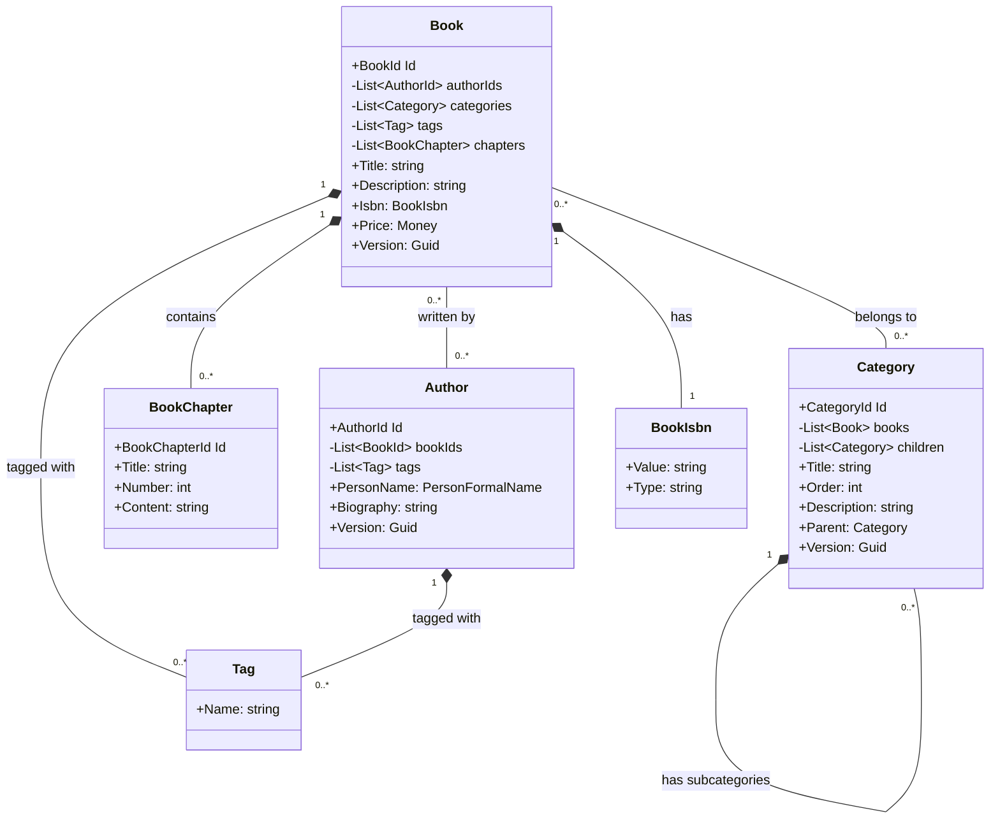

Catalog
=====================================

# Catalog Module overview

> The Catalog Module is responsible for managing the book catalog.

## Domain Model

The domain model provides a robust foundation for the module, capturing the essential entities and their relationships while adhering to Domain-Driven Design principles. It allows for complex operations such as managing books with multiple authors, hierarchical categorization, and flexible tagging, while maintaining clear boundaries between aggregates.

The domain model consists of two main aggregates: Book and Author. These aggregates, along with supporting entities and value objects, form the core of the domain model. A summary of each aggregate and their relationships:

### Book Aggregate

The Book aggregate is the central entity in the catalog module.

Components:
- Book (Aggregate Root): Represents a book in the catalog.
- BookChapter: Represents individual chapters within a book.
- BookIsbn: A value object representing the book's ISBN.
- Tag: A value object for categorizing books.

Relationships:
- A Book contains multiple BookChapters.
- Each Book has one BookIsbn.
- A Book can be tagged with multiple Tags.
- Books have a many-to-many relationship with Categories.
- Books have a many-to-many relationship with Authors, referenced by AuthorIds.

### Author Aggregate

The Author aggregate represents book authors in the module.

Components:
- Author (Aggregate Root): Represents an author.
- Tag: A value object for categorizing authors.

Relationships:
- An Author can be tagged with multiple Tags.
- Authors have a many-to-many relationship with Books, referenced by BookIds.

### Supporting Entities and Value Objects

1. Category:
   - Represents book categories.
   - Has a hierarchical structure (parent-child relationships).
   - Has a many-to-many relationship with Books.

2. Tag:
   - A value object used by both Book and Author for categorization.

### Key Relationships

1. Book-Author:
   - Many-to-many relationship.
   - Managed through typed IDs (BookId in Author, AuthorId in Book).
   - Allows for books with multiple authors and authors with multiple books.

2. Book-Category:
   - Many-to-many relationship.
   - Allows for flexible categorization of books.

3. Category Hierarchy:
   - Self-referential relationship in Category.
   - Enables the creation of a category tree structure.

4. Tagging:
   - Both Books and Authors can be tagged.
   - Provides a flexible way to add metadata and improve searchability.

