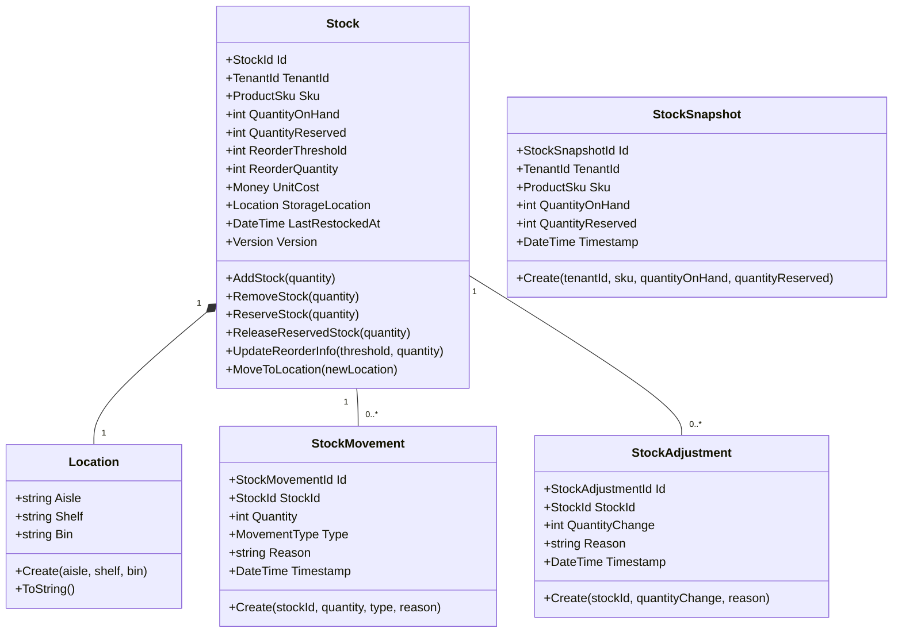

Inventory
=====================================

# Inventory Module Overview

> The Inventory Module is responsible for managing the book inventories, tracking stock levels, and
> handling stock-related operations.

## Domain Model

The domain model captures the essential entities and their relationships within the Inventory
module. It provides a foundation for managing stock levels, tracking stock movements, and creating
historical snapshots, while maintaining clear boundaries between aggregates.

The domain model consists of two main aggregates: Stock and StockSnapshot. These aggregates, along
with supporting entities and value objects, form the core of the domain model. A summary of each
aggregate and their relationships:

### Stock Aggregate

The Stock aggregate is the central entity in the inventory module.

[Stock.cs](Inventory.Domain%2FModel%2FStockAggregate%2FStock.cs)

Components:

- Stock (Aggregate Root): Represents the current inventory state for a specific product.
- Location: A value object representing the storage location of the stock.
- StockMovement: An entity representing individual stock movements.
- StockAdjustment: An entity representing manual adjustments to stock levels.

Relationships:

- A Stock is identified by a unique ProductSku.
- Each Stock has one Location.
- A Stock can have multiple StockMovements.
- A Stock can have multiple StockAdjustments.

### StockSnapshot Aggregate

The StockSnapshot aggregate represents historical snapshots of stock levels.

[StockSnapshot.cs](Inventory.Domain%2FModel%2FStockSnapshotAggregate%2FStockSnapshot.cs)

Components:

- StockSnapshot (Aggregate Root): Represents a point-in-time record of stock levels.

Relationships:

- A StockSnapshot is associated with a specific ProductSku.
- StockSnapshots are created based on the current state of Stock entities but are managed
  independently.

### Supporting Entities and Value Objects

1. Location:

- Represents the physical storage location of stock within a warehouse or store.

1. StockMovement:

- Represents individual movements of stock (additions, removals, transfers).

1. StockAdjustment:

- Represents manual adjustments made to stock quantities.

### Key Relationships

1. Stock-ProductSku:

- One-to-one relationship.
- Each Stock is uniquely identified by a ProductSku.

2. Stock-Location:

- One-to-one relationship.
- Each Stock is associated with a specific storage Location.

3. Stock-StockMovement:

- One-to-many relationship.
- A Stock can have multiple StockMovements, tracking its history of quantity changes.

4. Stock-StockAdjustment:

- One-to-many relationship.
- A Stock can have multiple StockAdjustments, recording manual corrections to its quantity.

5. StockSnapshot-ProductSku:

- One-to-one relationship.
- Each StockSnapshot is associated with a specific ProductSku, allowing for historical tracking of
  stock levels for each product.

## Key Concepts and Operations

1. Stock Management:

- Adding and removing stock
- Reserving and releasing stock
- Updating reorder information
- Moving stock to different locations

2. Stock Movements:

- Tracking individual stock movements for auditing purposes
- Different types of movements (e.g., restocking, sales, transfers)

3. Stock Adjustments:

- Manual adjustments to stock levels
- Recording reasons for adjustments

4. Stock Snapshots:

- Creating point-in-time records of stock levels
- Historical tracking and analysis of stock levels

5. Inventory Queries:

- Checking current stock levels
- Reviewing stock movement history
- Analyzing historical stock levels through snapshots

## External API Endpoints

The following table describes the public HTTP API for this module:

- [InventoryStockEndpoints.cs](Inventory.Presentation%2FWeb%2FEndpoints%2FInventoryStockEndpoints.cs)
- [InventoryStockSnapshotEndpoints.cs](Inventory.Presentation%2FWeb%2FEndpoints%2FInventoryStockSnapshotEndpoints.cs)

| Endpoint                                                                 | HTTP Method | Description                                                   |
|--------------------------------------------------------------------------|-------------|---------------------------------------------------------------|
| `/api/tenants/{tenantId}/inventory/stocks/{id}`                          | GET         | Retrieves a specific stock by ID.                             |
| `/api/tenants/{tenantId}/inventory/stocks`                               | GET         | Retrieves a list of all stocks.                               |
| `/api/tenants/{tenantId}/inventory/stocks`                               | POST        | Creates a new stock.                                          |
| `/api/tenants/{tenantId}/inventory/stocks/{id}/adjust`                   | POST        | Creates a new stock movement for a specific stock.            |
| `/api/tenants/{tenantId}/inventory/stocks/{stockId}/stocksnapshots/{id}` | GET         | Retrieves a specific stock snapshot by ID.                    |
| `/api/tenants/{tenantId}/inventory/stocks/{stockId}/stocksnapshots`      | GET         | Retrieves a list of all stock snapshots for a specific stock. |
| `/api/tenants/{tenantId}/inventory/stocks/{stockId}/stocksnapshots`      | POST        | Creates a new stock snapshot for a specific stock.            |

## Public API Client

This module provides a public API client that other modules can use to communicate with it.
The client exposes various methods to interact with the inventory module.

- [IInventoryModuleClient.cs](Inventory.Application.Contracts%2FIInventoryModuleClient.cs)

| Method                                                                                              | Description                                        |
|-----------------------------------------------------------------------------------------------------|----------------------------------------------------|
| `Task<Result<StockModel>> StockFindOne(string tenantId, string id)`                                 | Retrieves the details of a specific stock by ID.   |
| `Task<Result<IEnumerable<StockModel>>> StockFindAll(string tenantId)`                               | Retrieves a list of all stocks for a tenant.       |
| `Task<Result<StockModel>> StockCreate(string tenantId, StockModel model)`                           | Creates a new stock entry.                         |
| `Task<Result<StockModel>> StockMovementApply(string tenantId, string id, StockMovementModel model)` | Creates a new stock movement for a specific stock. |