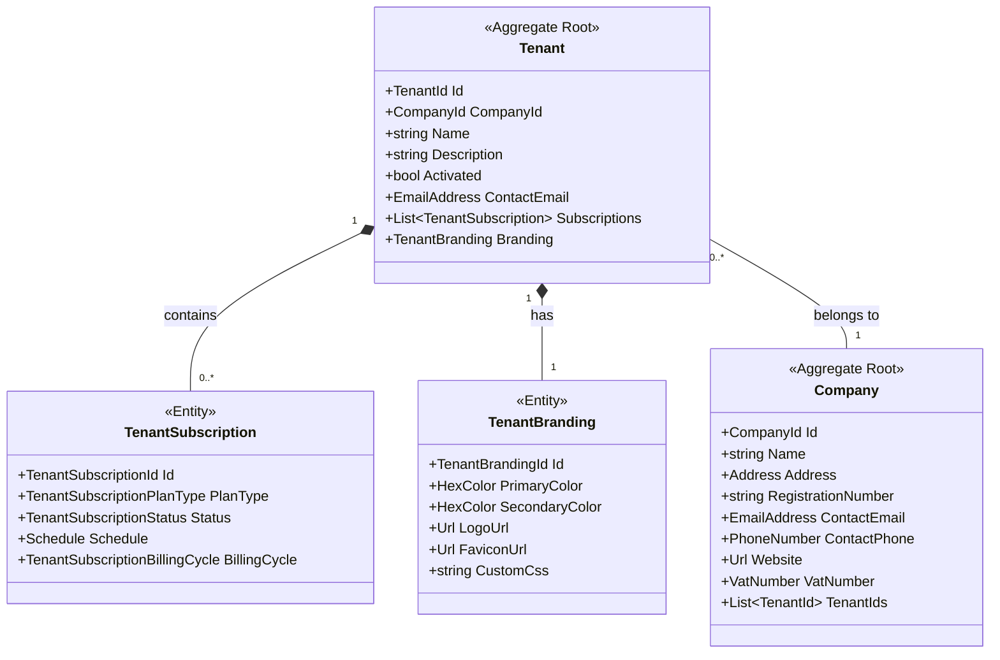

# Organization Module Overview

> The Organization Module is responsible for managing tenants, companies, and their associated
> subscriptions and branding.

## Domain Model

The domain model provides a robust foundation for the module, capturing the essential entities and
their relationships while adhering to Domain-Driven Design principles. It allows for complex
operations such as managing tenants, companies, subscriptions, and branding, while maintaining clear
boundaries between aggregates.

The domain model consists of two main aggregates: Tenant and Company. These aggregates, along with
supporting entities and value objects, form the core of the domain model. A summary of each
aggregate and their relationships:

### Tenant Aggregate

The Tenant aggregate is the central entity in the organization module.

Components:

- Tenant (Aggregate Root): Represents a client organization or individual using the shop platform.
- TenantSubscription (Entity): Represents the commercial agreements for the tenant.
- TenantBranding (Entity): Represents the branding information for the tenant.

Relationships:

- A Tenant belongs to one Company.
- A Tenant can have multiple TenantSubscriptions.
- A Tenant has one TenantBranding.

### Company Aggregate

The Company aggregate represents the parent organization of tenants.

Components:

- Company (Aggregate Root): Represents a company that can have multiple tenants.

Relationships:

- A Company can have multiple Tenants (referenced by TenantIds).

### Supporting Entities and Value Objects

1. TenantSubscription (Entity):
    - Represents a subscription plan for a tenant.
    - Contains information about the plan type, status, schedule, and billing cycle.

2. TenantBranding (Entity):
    - Represents the branding information for a tenant.
    - Contains colors, logo URLs, and custom CSS.

3. Value Objects:
    - TenantSubscriptionPlanType: Enumeration of subscription plan types (Free, Basic, Premium).
    - TenantSubscriptionStatus: Enumeration of subscription statuses (Pending, Approved, Cancelled,
      Ended).
    - TenantSubscriptionBillingCycle: Enumeration of billing cycles (Never, Monthly, Yearly).
    - EmailAddress, PhoneNumber, Url, VatNumber: Represent specific data types with their own
      validation rules.

### Key Relationships

1. Tenant-Company:
    - Many-to-one relationship.
    - A Tenant belongs to one Company, but a Company can have multiple Tenants.

2. Tenant-TenantSubscription:
    - One-to-many relationship within the Tenant aggregate.
    - A Tenant can have multiple TenantSubscriptions.

3. Tenant-TenantBranding:
    - One-to-one relationship within the Tenant aggregate.
    - Each Tenant has its own TenantBranding.

This domain model provides a flexible structure for managing organizations, tenants, and their
associated data in the system. It allows for complex operations while maintaining clear boundaries
between aggregates and ensuring data integrity through the use of specific value objects and
entities.