SharedKernel
=====================================

# SharedKernel Component Overview

> The SharedKernel is a crucial component in our Domain-Driven Design (DDD) architecture. It
> contains common elements, concepts, and utilities that are shared across multiple bounded contexts
> or modules in the system. These shared elements can come from any layer of the application
> architecture, including the domain layer, application layer, infrastructure layer, and
> presentation
> layer.

## Domain Layer

The following value objects are part of the domain layer within the SharedKernel:

### 1. Address

- Represents a general physical address
- Contains fields for name, line1, line2, postal code, city, and country

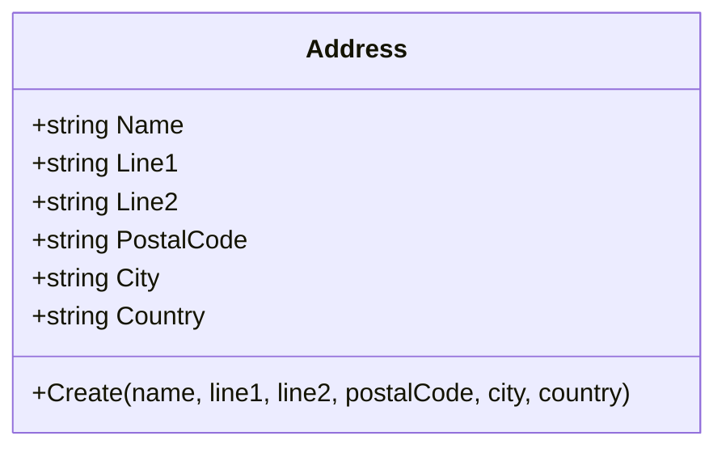

### 2. AverageRating

- Represents an average rating with the total number of ratings
- Provides methods to add or remove individual ratings

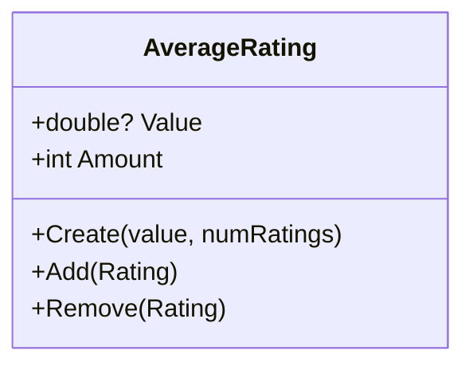

### 3. Currency

- Represents a monetary currency
- Provides a list of world currencies with their symbols

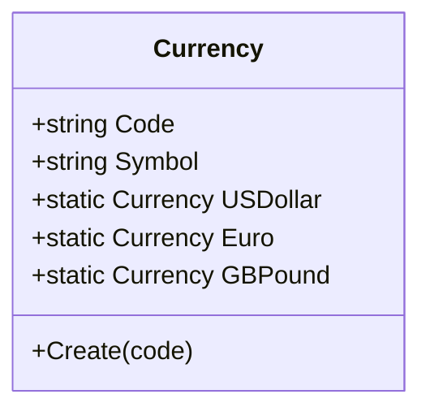

### 4. EmailAddress

- Represents a valid email address
- Validates the email format using a regular expression

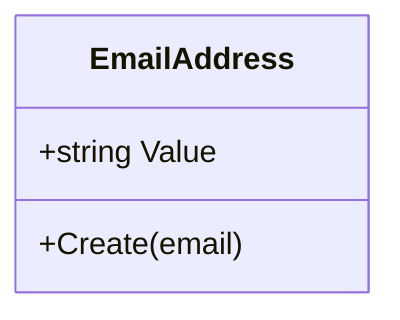

### 5. HexColor

- Represents a color in hexadecimal format
- Provides methods to create from string or RGB values

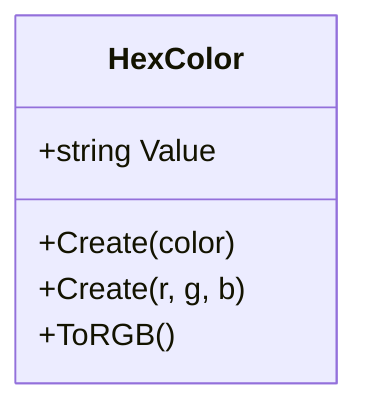

### 6. Money

- Represents a monetary amount with a specific currency
- Provides arithmetic operations (addition, subtraction)

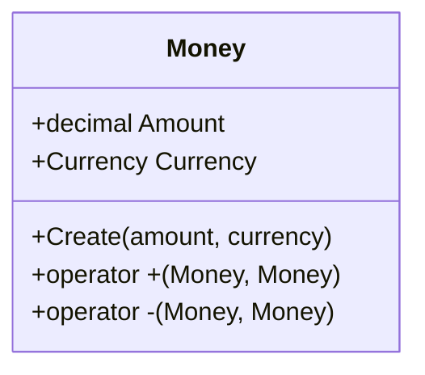

### 7. PersonFormalName

- Represents a person's formal name
- Stores name parts, title, and suffix separately

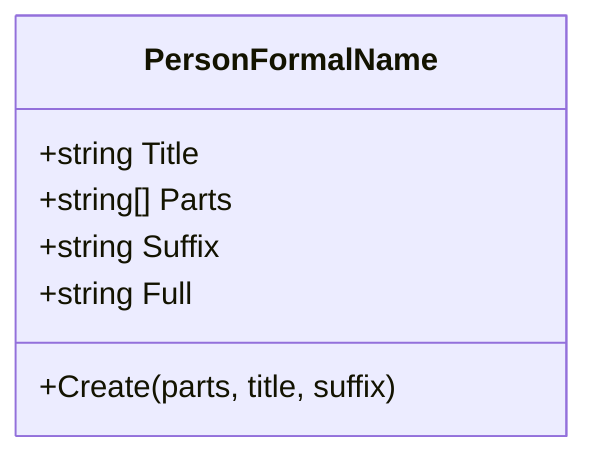

### 8. PhoneNumber

- Represents a phone number with country code
- Validates phone number format

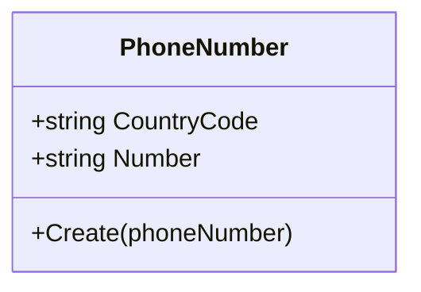

### 9. Rating

- Represents a single rating value
- Provides static methods for common ratings (Poor, Fair, Good, etc.)

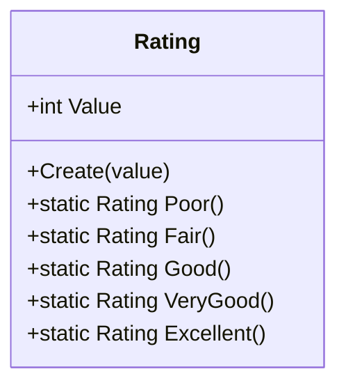

### 10. Schedule

- Represents a time period with a start date and an optional end date
- Supports open-ended schedules

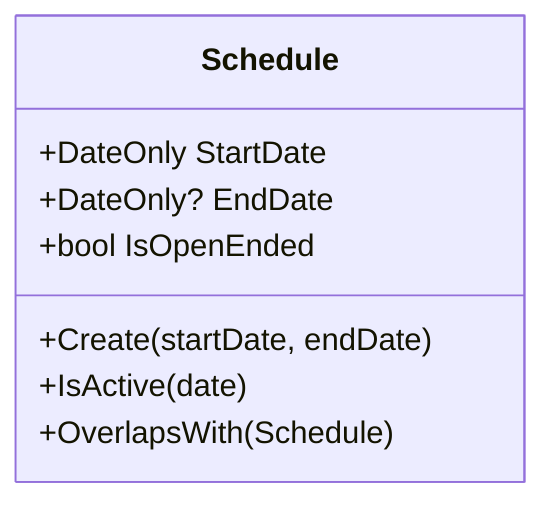

### 11. TenantId

- Represents a unique identifier for a tenant
- Implements the AggregateRootId<Guid> class

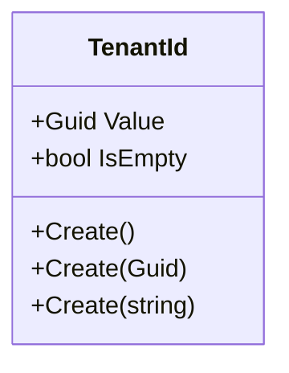

### 12. Url

- Represents a URL (Uniform Resource Locator)
- Supports absolute, relative, and local URLs

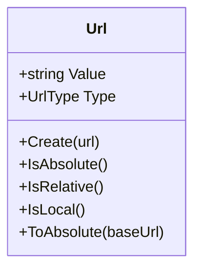

### 13. VatNumber

- Represents a VAT (Value Added Tax) or EIN (Employer Identification Number)
- Supports country-specific formatting

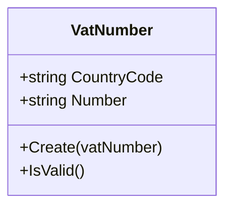

### 14. Website

- Represents a website address
- Normalizes and validates website URLs

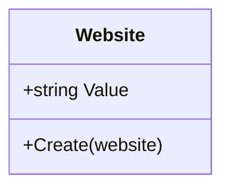

## Usage

These domain layer components are designed to be immutable and self-validating, ensuring that domain
logic is consistently applied across the entire system.

Example usage:

```csharp
var address = Address.Create("John Doe", "123 Main St", null, "12345", "Anytown", "USA");
var averageRating = AverageRating.Create(4.5, 10);
var currency = Currency.USDollar;
var email = EmailAddress.Create("user@example.com");
var color = HexColor.Create("#FF5733");
var money = Money.Create(100.50m, Currency.Euro);
var name = PersonFormalName.Create(new[] { "John", "Doe" }, "Mr.", "Jr.");
var phone = PhoneNumber.Create("+1234567890");
var rating = Rating.Create(4);
var schedule = Schedule.Create(new DateOnly(2023, 1, 1), new DateOnly(2023, 12, 31));
var url = Url.Create("https://example.com");
var vatNumber = VatNumber.Create("DE123456789");
var website = Website.Create("www.example.com");
```